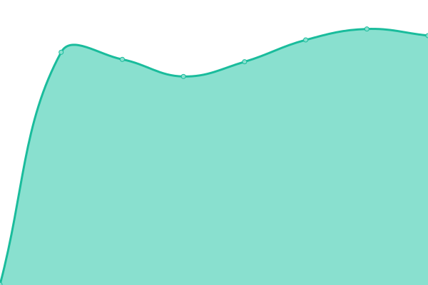

# [📈 Live Status](https://d0kify.github.io/upptime): <!--live status--> **🟩 All systems operational**

This repository contains the open-source uptime monitor and status page for [d0kify](https://d0kify.github.io/upptime), powered by [Upptime](https://github.com/upptime/upptime).

With [Upptime](https://upptime.js.org), you can get your own unlimited and free uptime monitor and status page, powered entirely by a GitHub repository. We use [Issues](https://github.com/d0kify/upptime/issues) as incident reports, [Actions](https://github.com/d0kify/upptime/actions) as uptime monitors, and [Pages](https://d0kify.github.io/upptime) for the status page.

<!--start: status pages-->
<!-- This summary is generated by Upptime (https://github.com/upptime/upptime) -->
<!-- Do not edit this manually, your changes will be overwritten -->
<!-- prettier-ignore -->
| URL | Status | History | Response Time | Uptime |
| --- | ------ | ------- | ------------- | ------ |
|  [Dokify](https://dokify.net) | 🟩 Up | [dokify.yml](https://github.com/d0kify/upptime/commits/HEAD/history/dokify.yml) | 

 555ms
     
 | 

<a href="https://d0kify.github.io/upptime/history/dokify">100.00%</a>
    

|  [Dokify App](https://app.dokify.net/blank.php) | 🟩 Up | [dokify-app.yml](https://github.com/d0kify/upptime/commits/HEAD/history/dokify-app.yml) | 

 197ms
     
 | 

<a href="https://d0kify.github.io/upptime/history/dokify-app">100.00%</a>
    

|  [Homologation Web](https://homologation.dokify.net) | 🟩 Up | [homologation-web.yml](https://github.com/d0kify/upptime/commits/HEAD/history/homologation-web.yml) | 

 463ms
     
 | 

<a href="https://d0kify.github.io/upptime/history/homologation-web">100.00%</a>
    

|  [Homologation Api](https://homologation-api.dokify.net/health-check) | 🟩 Up | [homologation-api.yml](https://github.com/d0kify/upptime/commits/HEAD/history/homologation-api.yml) | 

 465ms
     
 | 

<a href="https://d0kify.github.io/upptime/history/homologation-api">24.10%</a>
    

|  [Homologation WebSocket](https://homologation-api-nchan.dokify.net) | 🟩 Up | [homologation-web-socket.yml](https://github.com/d0kify/upptime/commits/HEAD/history/homologation-web-socket.yml) | 

 529ms
     
 | 

<a href="https://d0kify.github.io/upptime/history/homologation-web-socket">100.00%</a>
    

|  [Webhook Public Api](https://webhook.dokify.net/health-check) | 🟩 Up | [webhook-public-api.yml](https://github.com/d0kify/upptime/commits/HEAD/history/webhook-public-api.yml) | 

 433ms
     
 | 

<a href="https://d0kify.github.io/upptime/history/webhook-public-api">100.00%</a>
    

|  [Risk Evaluation Web](https://evaluation.dokify.net) | 🟩 Up | [risk-evaluation-web.yml](https://github.com/d0kify/upptime/commits/HEAD/history/risk-evaluation-web.yml) | 

 429ms
     
 | 

<a href="https://d0kify.github.io/upptime/history/risk-evaluation-web">100.00%</a>
    

|  [Forms Api](https://form.dokify.net/health-check) | 🟩 Up | [forms-api.yml](https://github.com/d0kify/upptime/commits/HEAD/history/forms-api.yml) | 

 515ms
     
 | 

<a href="https://d0kify.github.io/upptime/history/forms-api">100.00%</a>
    

|  Auth Service | 🟩 Up | [auth-service.yml](https://github.com/d0kify/upptime/commits/HEAD/history/auth-service.yml) | 

 475ms
     
 | 

<a href="https://d0kify.github.io/upptime/history/auth-service">100.00%</a>
    

|  Staging Homologation Front | 🟩 Up | [staging-homologation-front.yml](https://github.com/d0kify/upptime/commits/HEAD/history/staging-homologation-front.yml) | 

 718ms
     
 | 

<a href="https://d0kify.github.io/upptime/history/staging-homologation-front">87.67%</a>
    

|  Staging Homologation API | 🟩 Up | [staging-homologation-api.yml](https://github.com/d0kify/upptime/commits/HEAD/history/staging-homologation-api.yml) | 

 717ms
     
 | 

<a href="https://d0kify.github.io/upptime/history/staging-homologation-api">99.57%</a>
    

|  Staging Homologation WebSocket | 🟩 Up | [staging-homologation-web-socket.yml](https://github.com/d0kify/upptime/commits/HEAD/history/staging-homologation-web-socket.yml) | 

 665ms
     
 | 

<a href="https://d0kify.github.io/upptime/history/staging-homologation-web-socket">99.81%</a>
    

|  Staging Webhook Public Api | 🟩 Up | [staging-webhook-public-api.yml](https://github.com/d0kify/upptime/commits/HEAD/history/staging-webhook-public-api.yml) | 

 424ms
     
 | 

<a href="https://d0kify.github.io/upptime/history/staging-webhook-public-api">98.20%</a>
    

|  Staging Risk Evaluation Web | 🟩 Up | [staging-risk-evaluation-web.yml](https://github.com/d0kify/upptime/commits/HEAD/history/staging-risk-evaluation-web.yml) | 

 401ms
     
 | 

<a href="https://d0kify.github.io/upptime/history/staging-risk-evaluation-web">98.21%</a>
    

|  Staging Forms Api | 🟩 Up | [staging-forms-api.yml](https://github.com/d0kify/upptime/commits/HEAD/history/staging-forms-api.yml) | 

 400ms
     
 | 

<a href="https://d0kify.github.io/upptime/history/staging-forms-api">97.02%</a>
    

|  Demo Homologation Front | 🟩 Up | [demo-homologation-front.yml](https://github.com/d0kify/upptime/commits/HEAD/history/demo-homologation-front.yml) | 

 432ms
     
 | 

<a href="https://d0kify.github.io/upptime/history/demo-homologation-front">48.08%</a>
    

|  Demo Homologation API | 🟩 Up | [demo-homologation-api.yml](https://github.com/d0kify/upptime/commits/HEAD/history/demo-homologation-api.yml) | 

 437ms
     
 | 

<a href="https://d0kify.github.io/upptime/history/demo-homologation-api">97.11%</a>
    

|  Demo Homologation WebSocket | 🟩 Up | [demo-homologation-web-socket.yml](https://github.com/d0kify/upptime/commits/HEAD/history/demo-homologation-web-socket.yml) | 

 399ms
     
 | 

<a href="https://d0kify.github.io/upptime/history/demo-homologation-web-socket">99.22%</a>
    

|  Demo Webhook Public Api | 🟩 Up | [demo-webhook-public-api.yml](https://github.com/d0kify/upptime/commits/HEAD/history/demo-webhook-public-api.yml) | 

 370ms
     
 | 

<a href="https://d0kify.github.io/upptime/history/demo-webhook-public-api">97.90%</a>
    

|  Demo Risk Evaluation Web | 🟩 Up | [demo-risk-evaluation-web.yml](https://github.com/d0kify/upptime/commits/HEAD/history/demo-risk-evaluation-web.yml) | 

 407ms
     
 | 

<a href="https://d0kify.github.io/upptime/history/demo-risk-evaluation-web">44.54%</a>
    

|  Demo Forms Api | 🟩 Up | [demo-forms-api.yml](https://github.com/d0kify/upptime/commits/HEAD/history/demo-forms-api.yml) | 

 399ms
     
 | 

<a href="https://d0kify.github.io/upptime/history/demo-forms-api">97.83%</a>
    

|  WebHook Site | 🟩 Up | [web-hook-site.yml](https://github.com/d0kify/upptime/commits/HEAD/history/web-hook-site.yml) | 

 456ms
     
 | 

<a href="https://d0kify.github.io/upptime/history/web-hook-site">100.00%</a>
    

<!--end: status pages-->

[**Visit our status website →**](https://d0kify.github.io/upptime)

## 📄 License

- Powered by: [Upptime](https://github.com/upptime/upptime)
- Code: [MIT](./LICENSE) © [d0kify](https://d0kify.github.io/upptime)
- Data in the `./history` directory: [Open Database License](https://opendatacommons.org/licenses/odbl/1-0/)
